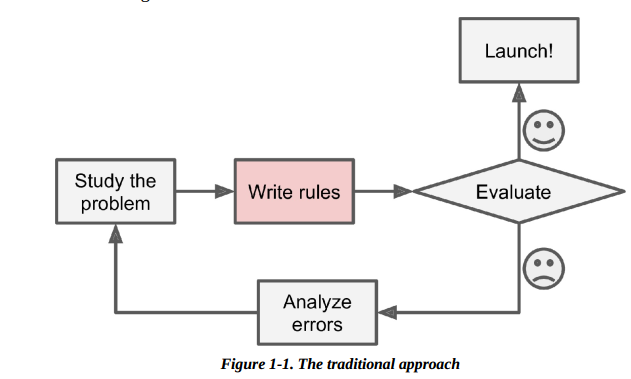
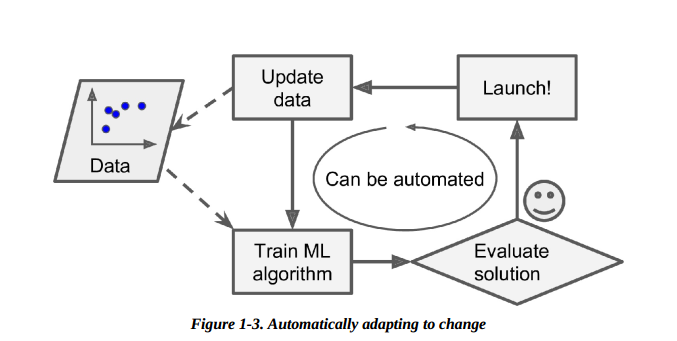

# 欢迎来到Virdel的博客！

| 机器学习 |
| -------- |
| 强化学习 |
| 深度学习 |
| GNN      |
| GAN      |
| Linux    |
| stm 32   |

[我的typora使用笔记](./Typora使用.md)

[git常用命令](.\git常用)

[我的第一个项目--矩阵位移法](https://github.com/virdel/Matrix-Displacement-Method)

# 机器学习

传统方法

**机器学习方法**

**机器学习适用于：**

* 有解决方案（但解决方案需要进行大量人工微调或需要遵循大量规则）的问题：机器学习算法通常可以简化代码，相比传统方法有更好的性能。
* 传统方法难以解决的复杂问题：最好的机器学习技术也许可以找到解决方案
* 环境有波动：机器学习算法可以适应新数据
* 洞察复杂问题和大量数据

